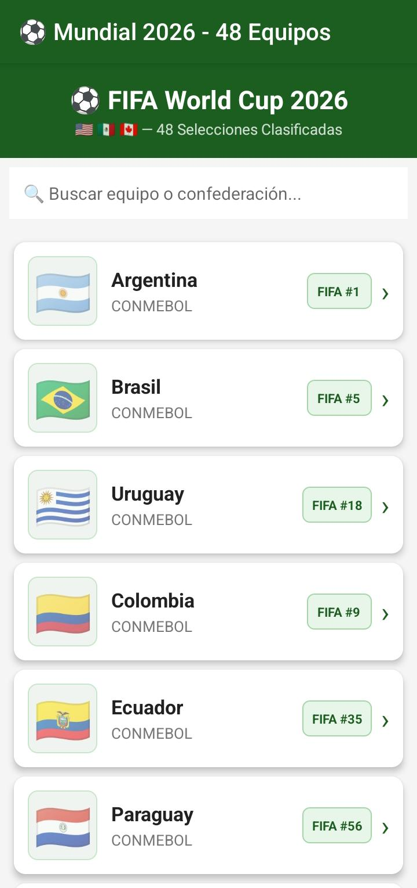
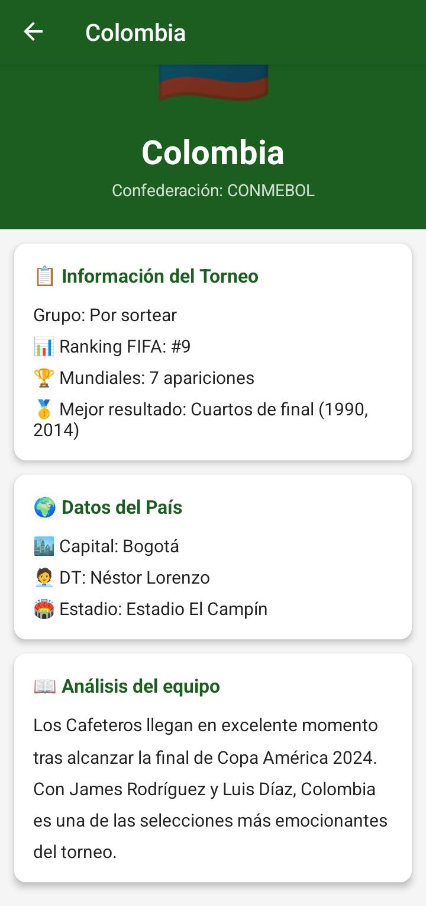

# ⚽ Mundial 2026 - App Android

Aplicación Android nativa desarrollada en **Java** que muestra las **48 selecciones clasificadas** al FIFA World Cup 2026 (EE.UU., México y Canadá como sedes).

---

## 📱 Capturas de pantalla

| Lista de Equipos | Detalle del Equipo |
|:---:|:---:|
|  |  |
| Lista con bandera, nombre, confederación y ranking FIFA | Bandera grande, estadísticas completas y descripción del equipo |

---

## 🚀 Funcionalidades

- ✅ **Lista de 48 equipos** clasificados al Mundial 2026
- ✅ **Bandera emoji** de cada país visible en la lista
- ✅ **Buscador en tiempo real** por nombre de equipo o confederación
- ✅ **Ranking FIFA** de cada selección en la lista
- ✅ **Pantalla de detalle** al presionar cada equipo con:
  - Bandera grande del país
  - Nombre del equipo
  - Confederación (CONMEBOL, UEFA, CONCACAF, CAF, AFC, OFC)
  - Grupo del torneo
  - Entrenador actual
  - Capital del país
  - Ranking FIFA
  - Número de participaciones en Mundiales
  - Mejor resultado histórico
  - Estadio principal
  - Descripción y análisis del equipo
- ✅ **Botón de retroceso** desde la pantalla de detalle
- ✅ **Diseño con CardView** y colores temáticos del Mundial

---

## 🌍 Equipos por Confederación

| Confederación | Equipos |
|---|---|
| 🌎 CONMEBOL | Argentina, Brasil, Uruguay, Colombia, Ecuador, Paraguay |
| 🌍 UEFA | España, Francia, Alemania, Portugal, Inglaterra, Países Bajos, Bélgica, Italia, Croacia, Suiza, Austria, Escocia, Serbia, Polonia, Dinamarca, Rumanía, Turquía, Hungría, Eslovenia |
| 🌎 CONCACAF | Estados Unidos, México, Canadá, Costa Rica, Honduras, Jamaica |
| 🌍 CAF | Marruecos, Senegal, Nigeria, Costa de Marfil, Egipto, Camerún, Ghana, Sudáfrica, Malí |
| 🌏 AFC | Japón, Corea del Sur, Arabia Saudita, Australia, Irán, Qatar, Uzbekistán, Irak |
| 🌏 OFC | Nueva Zelanda |

**Total: 48 selecciones**

---

## 🏗️ Arquitectura del Proyecto

```
MundialApp2026/
├── screenshots/
│   ├── lista.png        # Captura de la lista de equipos
│   └── detalle.png      # Captura del detalle de equipo
├── app/
│   ├── src/
│   │   └── main/
│   │       ├── java/com/mundial2026/app/
│   │       │   ├── MainActivity.java          # Pantalla principal (lista)
│   │       │   ├── TeamDetailActivity.java    # Pantalla de detalle
│   │       │   ├── TeamAdapter.java           # Adapter del RecyclerView
│   │       │   ├── Team.java                  # Modelo de datos
│   │       │   └── TeamsData.java             # Base de datos local (48 equipos)
│   │       ├── res/
│   │       │   ├── layout/
│   │       │   │   ├── activity_main.xml       # Layout lista principal
│   │       │   │   ├── activity_team_detail.xml # Layout detalle
│   │       │   │   └── item_team.xml           # Layout ítem de lista
│   │       │   ├── values/
│   │       │   │   ├── colors.xml
│   │       │   │   ├── strings.xml
│   │       │   │   └── styles.xml
│   │       │   └── drawable/
│   │       │       ├── flag_background.xml
│   │       │       └── ranking_badge.xml
│   │       └── AndroidManifest.xml
│   └── build.gradle
├── build.gradle
├── settings.gradle
├── gradle.properties
└── README.md
```

---

## 🛠️ Tecnologías Utilizadas

- **Lenguaje:** Java
- **SDK mínimo:** API 21 (Android 5.0 Lollipop)
- **SDK objetivo:** API 34 (Android 14)
- **RecyclerView** — Lista de equipos con scroll
- **CardView** — Tarjetas para cada equipo
- **AppCompat** — Compatibilidad con versiones anteriores
- **Intents** — Navegación entre Activities

---

## ⚙️ Cómo ejecutar el proyecto

### Requisitos previos
- Android Studio **Hedgehog (2023.1.1)** o superior
- Java Development Kit (JDK) 8 o superior
- Android SDK 34
- Un dispositivo físico Android o emulador (API 21+)

### Pasos para importar y ejecutar

1. **Clonar el repositorio:**
   ```bash
   git clone https://github.com/DanMox-24/MundialApp2026.git
   ```

2. **Abrir en Android Studio:**
   - Abre Android Studio
   - Selecciona `File > Open`
   - Navega hasta la carpeta `MundialApp2026` y ábrela

3. **Sincronizar Gradle:**
   - Android Studio detectará el proyecto automáticamente
   - Haz clic en `Sync Now` si aparece la notificación
   - Espera a que termine la sincronización (puede tardar 1-2 minutos la primera vez)

4. **Ejecutar la app:**
   - Conecta un dispositivo Android vía USB (con depuración USB activada) **o** inicia un emulador
   - Haz clic en el botón ▶️ **Run 'app'** (Shift + F10)
   - Selecciona tu dispositivo/emulador
   - ¡La app se instalará y ejecutará automáticamente!

---

## 📋 Cómo usar la aplicación

1. **Pantalla principal:** Verás la lista completa de los 48 equipos con su bandera, nombre, confederación y ranking FIFA.
2. **Buscar equipos:** Escribe en el campo de búsqueda para filtrar por nombre o confederación (ej: "CONMEBOL", "Argentina").
3. **Ver detalle:** Toca cualquier equipo de la lista para ver toda su información detallada.
4. **Volver:** Usa el botón de retroceso `←` en la barra superior o el botón físico de retroceso del dispositivo.

---

## 🎨 Diseño

La app utiliza una paleta de colores inspirada en el fútbol:
- **Verde oscuro** (`#1B5E20`) como color primario — representa el césped del campo
- **Dorado** (`#FFD700`) como acento — representa el trofeo
- **Fondo gris claro** — para mayor legibilidad

---

## 📦 Estructura de clases

### `Team.java`
Modelo de datos con todos los atributos de cada selección:
- `name` — Nombre del país
- `flagEmoji` — Emoji de la bandera nacional
- `confederation` — Confederación FIFA
- `group` — Grupo del torneo
- `coach` — Entrenador actual
- `capitalCity` — Ciudad capital
- `fifaRanking` — Posición en el ranking FIFA
- `worldCupAppearances` — Participaciones en Mundiales
- `bestResult` — Mejor resultado histórico
- `stadium` — Estadio principal
- `description` — Descripción y análisis del equipo

### `TeamsData.java`
Clase estática con los datos hardcoded de los 48 equipos clasificados al Mundial 2026, organizados por confederación.

### `TeamAdapter.java`
Adapter para el `RecyclerView` que infla el layout `item_team.xml` y maneja los clicks para navegar al detalle.

### `MainActivity.java`
Activity principal que:
- Muestra la lista de equipos en un `RecyclerView`
- Implementa el buscador en tiempo real con `TextWatcher`

### `TeamDetailActivity.java`
Activity de detalle que:
- Recibe el índice del equipo via `Intent`
- Muestra toda la información del equipo seleccionado
- Implementa navegación hacia atrás

---

## 🧑‍💻 Autor

Desarrollado como proyecto académico por Daniel Mateus.

**FIFA World Cup 2026** — USA 🇺🇸 | México 🇲🇽 | Canadá 🇨🇦

---

## 📄 Licencia

Este proyecto es de uso académico y educativo.
